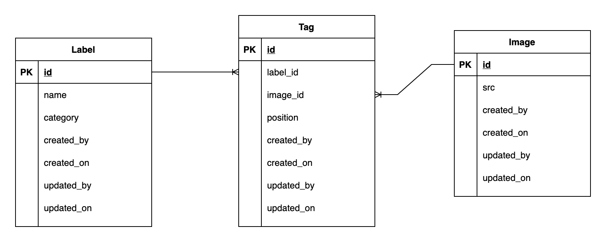
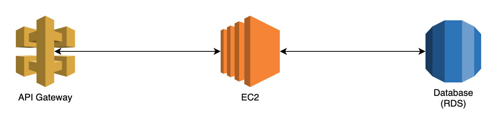
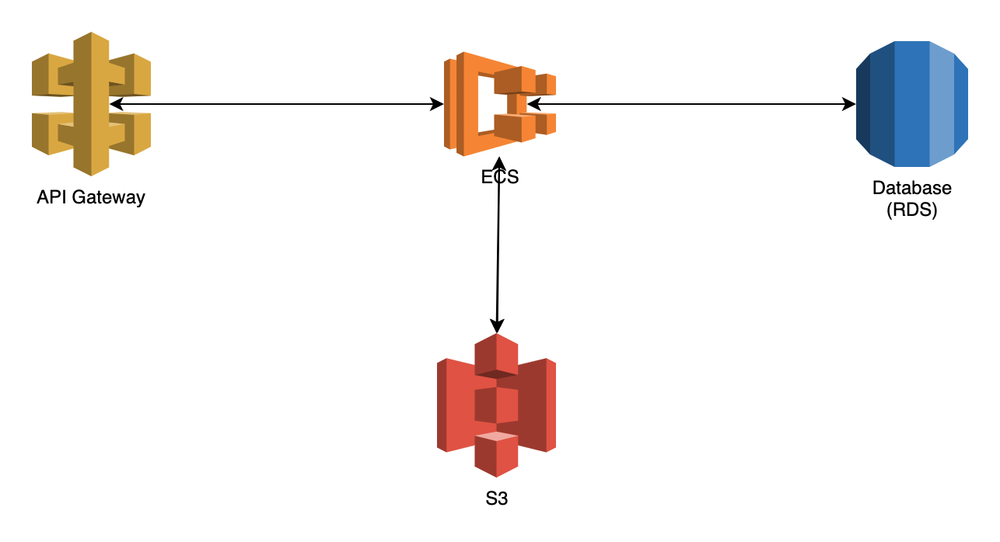

## Image annotation API project information

## Technology and frameworks

- Language: Python
- Web framework: Django with Django rest framework
- Database:
  -- Local development: sqlite
  -- Production environment: Postgres

## Project structure

| Folder             | Description                                     |
| ------------------ | ----------------------------------------------- |
| api                | Django API app                                  |
| --migrations       | DB migrations files                             |
| --tests            | Test files                                      |
| --models.py        | Defines DB models to use in project             |
| --serializers.py   | Defines models<->dict serializers               |
| --urls.py          | Defines API URLs                                |
| --utils.py         | Defines utilities functions                     |
| --views.py         | Defines API handlers                            |
| demo               | Demo files to test with restclient              |
| image_annotate     | Project configuration folders                   |
| --settings         | Project settings                                |
| ----base.py        | Base project settings, contains common settings |
| ----local.py       | Project settings to use in local development    |
| ----production.py  | Project settings to use in production           |
| scripts            | Contains scripts to start/test                  |
| uploads            | File uploads (image) folder                     |
| docker-compose.yml |                                                 |
| Dockerfile         |                                                 |
| entry.sh           | Start script in production                      |
| manage.py          |                                                 |
| requirements.txt   | Defines project requirements                    |
| restclient.http    | Testing rest calls                              |

## Database

Diagram

## Production Deployment

Suppose that this application will be deploy AWS
Database will be hosted by RDS.

#### Diagram

#### Deployment steps

- (1) Prepare infrastructure, create EC2 instance, RDS
- (2) Build docker image, push to ECR
- (3) SSH to EC2 instance, install docker
- (4) Pull latest image, map domain and internal pỏt

Note:

- Step (1) only do once
- When new release is made, step (2) and (4) will be done
- For zero downtime during deployment, we can start 2 backend server and create a load balancer to share request between them. When deploy, we deploy one by one so every request will have a handler

- For further scale and automate the deployment, we can setup with following infra

